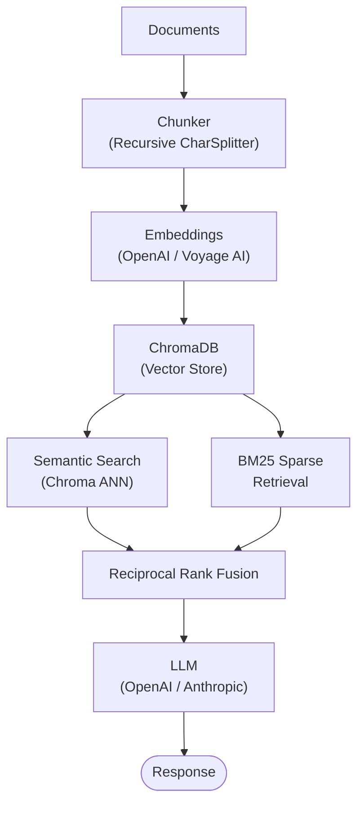

# RAG Reference Pipeline

**Production-ready Retrieval-Augmented Generation with hybrid search**

A reference implementation demonstrating a modern RAG architecture with hybrid
retrieval (semantic + BM25), multi-provider embeddings, and a clean FastAPI
service layer. Built as a portfolio showcase for AI Architect roles.

---

## Architecture



---

## Features

- **Hybrid retrieval** -- combines dense semantic search with sparse BM25 via
  Reciprocal Rank Fusion (RRF) for higher recall and precision.
- **Multi-provider embeddings** -- switch between OpenAI and Voyage AI
  embeddings with a single environment variable.
- **Multi-provider LLM** -- generate answers with OpenAI GPT-4o or Anthropic
  Claude via LangChain.
- **ChromaDB vector store** -- persistent, local-first vector database with
  collection management.
- **Configurable chunking** -- recursive character splitting with tuneable
  chunk size and overlap.
- **FastAPI service** -- async REST API with Pydantic request/response models,
  health checks, and OpenAPI docs.
- **Docker-ready** -- single-command deployment with `docker compose`.

---

## Quick Start

### With uv (recommended)

```bash
# Clone the repo
git clone https://github.com/<your-username>/rag-reference-pipeline.git
cd rag-reference-pipeline

# Create environment and install
uv venv && source .venv/bin/activate
uv pip install -e ".[dev]"

# Configure
cp .env-template .env
# Edit .env with your API keys

# Run the server
uvicorn api.main:app --reload
```

### With Docker

```bash
cp .env-template .env
# Edit .env with your API keys

docker compose up --build
```

The API will be available at `http://localhost:8000`. Interactive docs live at
`http://localhost:8000/docs`.

---

## API Endpoints

| Method | Path      | Description                              |
|--------|-----------|------------------------------------------|
| GET    | `/health` | Liveness / readiness probe               |
| POST   | `/ingest` | Chunk and ingest documents               |
| POST   | `/query`  | Query the RAG pipeline                   |

### POST /ingest

```json
{
  "documents": [
    {
      "content": "Your document text here...",
      "metadata": {"source": "manual", "author": "Jane"}
    }
  ]
}
```

**Response**

```json
{
  "ingested": 1,
  "chunks": 3
}
```

### POST /query

```json
{
  "question": "What is retrieval-augmented generation?",
  "top_k": 5
}
```

**Response**

```json
{
  "answer": "Retrieval-Augmented Generation is...",
  "sources": [
    {
      "content": "chunk text...",
      "metadata": {"source": "manual", "chunk_index": 0}
    }
  ]
}
```

---

## Configuration

All settings are controlled via environment variables (see `.env-template`).

| Variable              | Default                    | Description                       |
|-----------------------|----------------------------|-----------------------------------|
| `OPENAI_API_KEY`      | --                         | OpenAI API key                    |
| `ANTHROPIC_API_KEY`   | --                         | Anthropic / Voyage AI API key     |
| `LLM_PROVIDER`        | `openai`                   | `openai` or `anthropic`           |
| `EMBEDDING_PROVIDER`  | `openai`                   | `openai` or `voyage`              |
| `CHROMA_PERSIST_DIR`  | `./chroma_data`            | ChromaDB storage path             |
| `CHUNK_SIZE`          | `1000`                     | Characters per chunk              |
| `CHUNK_OVERLAP`       | `200`                      | Overlap between chunks            |
| `SEMANTIC_K`          | `10`                       | Semantic search candidates        |
| `BM25_K`              | `10`                       | BM25 search candidates            |
| `FINAL_TOP_K`         | `5`                        | Documents sent to the LLM         |

---

## Tech Stack

| Layer        | Technology                                  |
|--------------|---------------------------------------------|
| Framework    | FastAPI + Uvicorn                           |
| Orchestration| LangChain                                   |
| Embeddings   | OpenAI `text-embedding-3-small` / Voyage AI |
| Vector Store | ChromaDB                                    |
| Sparse Search| rank-bm25 (BM25Okapi)                      |
| LLM          | OpenAI GPT-4o / Anthropic Claude            |
| Packaging    | Hatchling + uv                              |
| Linting      | Ruff                                        |
| Testing      | pytest                                      |
| Container    | Docker + Docker Compose                     |

---

## License

MIT
